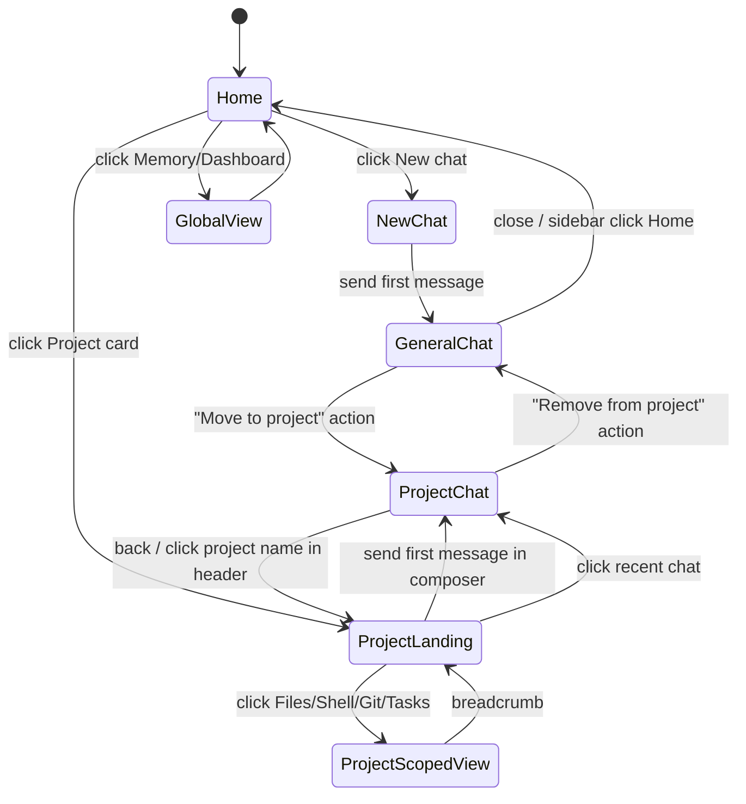

# claudecodeui UI 重构 PRD — 仅保留 Claude Code + 仿 ChatGPT 形态

- 文档状态：Draft v1
- 作者：自动生成草稿，待评审
- 日期：2026-04-23
- 关联原型：[prototype/index.html](./prototype/index.html)（双击用浏览器打开即可）
- 关联仓库：[claudecodeui](../../../claudecodeui)

---

## 1. 背景与目标

### 1.1 背景

当前 `claudecodeui` 是个多 provider（Claude / Cursor / Codex / Gemini）的 UI，信息架构上：

- Sidebar 为**树状结构**：每个 Project 行可展开挂 Session 列表（见 [`SidebarProjectItem.tsx`](../../../claudecodeui/src/components/sidebar/view/subcomponents/SidebarProjectItem.tsx)）。
- Project 等同于**文件系统目录**，元数据极简（`displayName / manuallyAdded / originalPath`），没有 description / color / instructions / knowledge 等 "project 一等公民" 所需的字段（见 [`server/projects.js`](../../../claudecodeui/server/projects.js)）。
- MainContent 用 tab 切换 `chat / files / shell / git / tasks / memory / always-on / dashboard / plugin:*`（见 [`MainContent.tsx`](../../../claudecodeui/src/components/main-content/view/MainContent.tsx)）。
- 多 provider 存在于类型、路由、sidebar badge、composer 选择器等多处。

### 1.2 目标

对齐 ChatGPT 的 "Project + Chat" 心智模型，做一次大幅 UI 重构：

1. 左侧 Sidebar 重构成**三段式**：Global Nav（原 MainContent 所有 tab 左移，Shell/Git 折叠）→ Projects → Chats（general + project chats 扁平列表 + project badge）。
2. 新增 **Project Landing 页**：进入 project 不是直接进 chat，而是进一个带 composer + instructions + knowledge + recent chats 的 landing 页。
3. 新增 **General Chat**：不属于任何 project 的轻量对话，顶部 "+ New chat" 按钮 + Chats 列表均支持。
4. **仅保留 Claude Code** provider：UI 层隐藏 Cursor / Codex / Gemini，类型收窄，后端路由暂返 501（代码暂保留，v2 删）。
5. 路由语义对齐 ChatGPT：`/p/:projectName` 是 project landing，`/p/:projectName/c/:sessionId` 是 project 内 chat，`/chat/:sessionId` 是 general chat。

### 1.3 非目标

- 不动 `memory-core` 的 schema 与 dashboard 行为（只改入口位置）。
- 不改 Claude CLI 的 `~/.claude/projects/<encoded>/*.jsonl` 存储格式。
- 不做 `AlwaysOnPanel` / `TaskMasterPanel` / `RoutingDashboard` 的重设计，只调入口。
- 不实现多用户 / 权限 / 团队协作。
- 不做 Figma 交付，只出 HTML 原型。

---

## 2. 现状诊断（要改动的关键点）

### 2.1 Sidebar 树状 vs Project 一等公民

[`SidebarProjectList.tsx`](../../../claudecodeui/src/components/sidebar/view/subcomponents/SidebarProjectList.tsx) → `SidebarProjectItem.tsx` 目前让 Project 行可展开挂 `SidebarProjectSessions`。这是"文件管理器"的形态而非"Project landing"的形态。

### 2.2 MainContent tab 布局

[`MainContentHeader.tsx`](../../../claudecodeui/src/components/main-content/view/subcomponents/MainContentHeader.tsx) + `MainContentTabSwitcher.tsx` 把 tab 横排在主区域顶部；移动端会横向滚动。改成 sidebar 左侧垂直导航后，水平空间释放给实际内容。

### 2.3 多 provider 散落

- 类型：[`src/types/app.ts`](../../../claudecodeui/src/types/app.ts) `SessionProvider = 'claude' | 'cursor' | 'codex' | 'gemini'`
- 后端路由：[`server/routes/cursor.js`](../../../claudecodeui/server/routes/cursor.js)、[`server/routes/codex.js`](../../../claudecodeui/server/routes/codex.js)、[`server/routes/gemini.js`](../../../claudecodeui/server/routes/gemini.js)
- CLI：[`server/cursor-cli.js`](../../../claudecodeui/server/cursor-cli.js)、[`server/openai-codex.js`](../../../claudecodeui/server/openai-codex.js)、[`server/gemini-cli.js`](../../../claudecodeui/server/gemini-cli.js)
- Session 发现：[`server/projects.js`](../../../claudecodeui/server/projects.js) 里的 Cursor MD5 hash 逻辑。

### 2.4 Project 元数据缺失

`~/.claude/project-config.json` 只有 `displayName / manuallyAdded / originalPath`；要加 `description / color / icon / instructions / knowledge / pinnedSessions`。

---

## 3. 新信息架构（3-pane）

整体从"Sidebar + Main"2-pane 升级为"Sidebar + Chat + Right Panel"3-pane：

```mermaid
flowchart LR
  subgraph app [App Shell]
    direction LR
    sidebar["Sidebar (260px, collapsible)"]
    chat["Chat / Landing (flex-1)"]
    panel["Right Panel (320px, collapsible)"]
  end
  sidebar --> chat
  chat <-->|@file insert| panel
```

三栏职责分工：

| 栏 | 宽度 | 职责 | 可收起 |
|---|---|---|---|
| **Sidebar** | 260px | 导航：New chat / 全局工具 / Projects / Chats | 折叠为 56px 图标列 |
| **Chat** | flex-1 | 聊天流、Project landing、Home | 始终可见 |
| **Right Panel** | 320px（可拖） | 当前 cwd 的 Files / Shell / Git（3 tab） | 完全隐藏 |

### 3.1 Sidebar 极简 5 段式

| 区块 | 内容 | 说明 |
|---|---|---|
| Header | Logo + 折叠按钮 | — |
| New chat | 主按钮（⌘N） | 新建 general chat |
| Global tools | Memory / Always-On / Tasks / Dashboard | **仅 4 项**；点击触发全屏工具视图 |
| Projects | 项目列表 + "+ New" | 点击 → project landing |
| Chats | 扁平列表 + project badge | 点击 → chat view |
| Footer | Settings + User + Version | — |

相比 v1 砍掉：
- `Chat` 入口（New chat / Chats 条目已覆盖）
- `Files / Shell / Git` 独立入口（合并进右侧面板）
- `Dev tools` 折叠组（同上）
- `Plugins` 折叠组（改入 Settings → Plugins 管理页）

### 3.2 右侧面板角色

- **Project chat / Project landing** → 右侧面板默认展开，cwd = project path
- **General chat** → 默认收起；手动展开时显示 `$HOME` 的 file tree
- **Home（`/`）** → 不显示右侧面板
- **全屏工具视图** → 右侧面板暂时隐藏，退回 chat 恢复之前状态

### 3.3 右侧面板 3 个 tab

```
┌ Files | Shell | Git ──────── [x hide] ┐
│                                        │
│ Files: file tree (cwd 根)              │
│ Shell: StandaloneShell                 │
│ Git:   GitPanel                        │
│                                        │
└────────────────────────────────────────┘
```

- 切换时保持每个 tab 的自己的 scroll / 打开状态
- 关闭（`x`）整面板都收起；再打开时恢复上次 tab

### 3.4 全屏工具视图

点 sidebar 的 Memory / Always-On / Tasks / Dashboard：

- 中间 chat 和右侧面板**合并成一个全屏工具区**
- 只保留 sidebar（用户仍可跨工具切换）
- 工具区顶部面包屑 `Home › Memory`，右上 `Back to chat`（或再点 sidebar 的 chat/project 条目）回到 3-pane，面板状态（open/tab/width）按 project 记忆，能还原

---

## 4. 新路由表

| 路径 | 视图 | 说明 |
|---|---|---|
| `/` | Home 空态 | 无 project 无 chat，展示 Projects grid + 入门提示 + 最近 chats |
| `/chat/:sessionId` | General Chat | 不属于任何 project，cwd 默认 `$HOME` |
| `/new-chat` | General Chat 空态 | 点击 "+ New chat" 进入，发第一条消息后重定向到 `/chat/:newId` |
| `/p/:projectName` | Project Landing | composer + instructions + knowledge + recent chats |
| `/p/:projectName/c/:sessionId` | Project Chat | 在 project 上下文内的 chat |
| `/memory` | Memory（全局） | 全屏工具视图；未选 project 时显示 project 选择器 |
| `/memory/:projectName` | Memory（项目） | 全屏工具视图 |
| `/always-on/:projectName` | Always-On Panel | 全屏工具视图 |
| `/tasks/:projectName` | TaskMaster Panel | 全屏工具视图 |
| `/dashboard` | RoutingDashboard | 全屏工具视图 |
| `/settings/plugins` | Plugin 管理 | 原 `plugin:*` tab 并入 Settings |
| `/session/:sessionId` | 兼容重定向 | 查到 session 的 project，跳 `/p/:projectName/c/:sessionId` 或 `/chat/:sessionId` |

**注意**：`Files / Shell / Git` 不再拥有独立 URL —— 它们是 chat 视图的右侧伴随面板，通过 chat route 里的 `?panel=files|shell|git` query 或 `useUiPreferences` 控制开合，不参与历史栈。

### 4.1 路由状态机



---

## 5. 功能需求

### 5.1 Sidebar 结构与交互（极简）

**FR-5.1.1 Header**
- Logo 点击 → 回到 `/`。
- 折叠按钮把 sidebar 收成 56px 图标列，保留 New chat + 4 个全局工具 + Projects 颜色点图标 + Chats 隐藏。
- 折叠状态持久化到 `useUiPreferences.sidebarCollapsed`。

**FR-5.1.2 New chat 按钮**
- 顶部主按钮，样式参考 ChatGPT（圆角 + 边框 + `+` icon + 右侧 `⌘N` 提示）。
- 快捷键 `⌘N` / `Ctrl+N` 触发。
- 点击即跳 `/new-chat`，进入空 composer；发第一条消息触发 session 创建并重定向 `/chat/:newId`。

**FR-5.1.3 Global tools**
- **只有 4 项**：Memory / Always-On / Tasks / Dashboard。
- 每项：icon + label + 可选 badge（如 always-on 任务数）。
- 激活态：左侧 2px 指示条 + 背景高亮。
- 点击触发全屏工具视图（见 §5.7）。
- `Tasks` 在未装 task-master 时不显示（复用现有 `useTasksSettings.isTaskMasterInstalled`）。

**FR-5.1.4 Projects 区**
- 标题行 "PROJECTS" + "+ New" icon（触发 [`ProjectCreationWizard`](../../../claudecodeui/src/components/project-creation-wizard/ProjectCreationWizard.tsx)）。
- 项目行：
  - 颜色点（2×2 圆） + displayName + hover 显示 kebab 菜单（rename / edit / star / delete）
  - 不展开 sessions
- Starred 置顶。
- 拖拽排序 v2。

**FR-5.1.5 Chats 区**
- 标题行 "CHATS" + 搜索图标（点击展开 inline input）。
- 列表项：summary（一行）+ 次行 `project badge · 相对时间`；无 project 时 badge 显示 `General`（灰色点）。
- 默认 30 条，下拉加载更多。
- 空态文案：`No chats yet — click New chat to start`。
- 点击：general 跳 `/chat/:id`，project 跳 `/p/:name/c/:id`。

**FR-5.1.6 Footer**
- 保留现有 [`SidebarFooter`](../../../claudecodeui/src/components/sidebar/view/subcomponents/SidebarFooter.tsx)：Settings + User + Version。

### 5.2 Global tools 行为（全屏视图）

**FR-5.2.1 Memory** → `/memory` 或 `/memory/:projectName`，视图是 [`MemoryPanel`](../../../claudecodeui/src/components/main-content/view/memory/MemoryPanel.tsx) iframe。

**FR-5.2.2 Always-On** → `/always-on/:projectName`，复用 [`AlwaysOnPanel`](../../../claudecodeui/src/components/always-on/view/AlwaysOnPanel.tsx)。

**FR-5.2.3 Tasks** → `/tasks/:projectName`，复用 [`TaskMasterPanel`](../../../claudecodeui/src/components/task-master)。

**FR-5.2.4 Dashboard** → `/dashboard`，复用 [`RoutingDashboard`](../../../claudecodeui/src/components/routing-dashboard/RoutingDashboard.tsx)。

工具视图顶部统一 header：面包屑 + `Back to chat`。`Back to chat` 的目标是：**上次的 chat URL**（存 `useUiPreferences.lastChatRoute`，默认 `/`）。

### 5.3 General Chat

**FR-5.3.1 创建流程**
1. 点 sidebar "+ New chat" → `/new-chat`，展示空 composer + 欢迎语
2. 用户发第一条消息 → 前端调 `startClaudeSessionCommand`，`cwd = $HOME`（后端收到后解析为 `os.homedir()`），不注入 project instructions / knowledge
3. 收到 `session_created` 后 `navigate('/chat/:newId', { replace: true })`

**FR-5.3.2 cwd 策略**
- 默认 `$HOME`。
- Settings 里新增 `General chat working directory` 字段，允许改为任意绝对路径。
- 持久化到 localStorage `general-chat-cwd`，启动 session 时读取。

**FR-5.3.3 "Move to project" 动作**
- Chat header 右侧菜单加 `Move to project…`，弹 modal 选 project。
- 后端：在 metadata 层把 session id 关联到 project；不物理移动 jsonl（Claude CLI 的 jsonl 仍在原路径，但 UI 按 project 归属展示）。
- 需要一个 session→project 的轻量映射表，存到 `~/.claude/project-data/session-index.json`。

### 5.4 Projects

**FR-5.4.1 Landing 页布局**

```
┌────────────────────────────────────────┐
│ [color dot] Project name          [⋮]  │
│ description (editable)                 │
├────────────────────────────────────────┤
│ ┌ Composer ────────────────────────┐   │
│ │ How can Claude help with <proj>? │   │
│ │ [textarea]                       │   │
│ │ [📎 attach] [model] [send →]     │   │
│ └──────────────────────────────────┘   │
├────────────────────────────────────────┤
│ Instructions                 [Edit]    │
│ "Always use TypeScript. Prefer..."     │
├────────────────────────────────────────┤
│ Knowledge                    [+ Add]   │
│ □ design-spec.pdf    2.1 MB   [x]      │
│ □ api-reference.md  12 KB     [x]      │
├────────────────────────────────────────┤
│ Recent chats                [View all] │
│ · Refactor auth module   · 2h ago      │
│ · Fix memory leak        · yesterday   │
└────────────────────────────────────────┘
```

**FR-5.4.2 Composer**
- 复用 [`ChatInterface`](../../../claudecodeui/src/components/chat/view/ChatInterface.tsx) 里的 input 组件，抽为 `ChatComposer`。
- 发送时把 `selectedProject` 作为 cwd、读取 `instructions + knowledge` 注入。
- 首次发送后跳 `/p/:name/c/:newId`。

**FR-5.4.3 Instructions 编辑器**
- `textarea` + "Save" 按钮；max 8000 chars。
- 保存时调 `PATCH /api/projects/:name/metadata`，并在服务端 mirror 到 `<projectPath>/.claude/PROJECT.md`（不覆盖用户 `CLAUDE.md`）。
- 编辑中支持 `⌘S` 保存。

**FR-5.4.4 Knowledge**
- 拖拽 / 点击上传区；允许 `.md / .txt / .pdf / .csv / .json / 代码文件`，单文件 ≤ 20 MB，总量 ≤ 200 MB。
- 列表：文件名 + 大小 + 上传时间 + 删除按钮。
- 上传接口：`POST /api/projects/:name/knowledge`（multipart）。
- 落盘：`~/.claude/project-data/<name>/knowledge/<uuid>-<filename>`。
- 注入策略：新建 session 时，把 knowledge 路径传给 Claude CLI 的 `--add-dir` 或在 system prompt 里列出 `@file` 引用（v1 先用 system prompt，v2 评估 `--add-dir`）。

**FR-5.4.5 Recent chats**
- 最多 5 条；点击 `View all` 跳 `/chats?project=:name` 或展开 sidebar Chats 带过滤。

**FR-5.4.6 Landing 顶部 kebab 菜单**
- `Edit name / Edit color / Edit icon / Star / Open in Terminal / Delete project`

### 5.5 只保留 Claude Code — 清理清单

**v1（本次 PR 系列，非破坏性）**

UI 隐藏：
- [ ] `ChatInterface` composer 里 provider 选择器常量为 `'claude'`，不渲染选择 UI
- [ ] `SidebarSessionItem` / 搜索结果去掉 provider badge
- [ ] Settings 里移除 "Cursor / Codex / Gemini" 相关页签
- [ ] [`provider-auth`](../../../claudecodeui/src/components/provider-auth) 组件只保留 Claude 卡

类型收窄（feature flag `CLAUDE_ONLY=true` 控制，默认 true）：
- [ ] `SessionProvider` 类型新增注释 `@deprecated non-claude providers hidden in v1`
- [ ] 所有 `provider === 'cursor' | 'codex' | 'gemini'` 分支加 early return 或 warning

后端软禁用：
- [ ] [`server/routes/cursor.js`](../../../claudecodeui/server/routes/cursor.js) / `codex.js` / `gemini.js` 所有 endpoint 改为 `res.status(501).json({ error: 'Provider disabled in v1' })`
- [ ] [`server/projects.js`](../../../claudecodeui/server/projects.js) Cursor MD5 discovery 路径包一层 `if (!CLAUDE_ONLY)` 短路
- [ ] 保留文件不删，commit message 里标 "hidden, will be removed in v2"

**v2（后续 PR，破坏性）**

- [ ] 物理删除 `server/cursor-cli.js` / `server/openai-codex.js` / `server/gemini-cli.js`
- [ ] 删除 `server/routes/cursor.js` / `codex.js` / `gemini.js`
- [ ] `SessionProvider` 类型改为 `'claude'`
- [ ] 删除 [`llm-logo-provider`](../../../claudecodeui/src/components/llm-logo-provider) 里非 Claude 资源

### 5.6 右侧面板（Files / Shell / Git）

**FR-5.6.1 出现规则**

| 路由 | 默认状态 | cwd |
|---|---|---|
| `/p/:name`、`/p/:name/c/:id` | 展开，tab = `files` | project path |
| `/chat/:id`、`/new-chat` | 收起；可手动展开 | `$HOME` |
| `/` (Home) | 隐藏 | — |
| 全屏工具视图 | 隐藏 | — |

**FR-5.6.2 Tab 行为**

- Tab 头 3 个按钮：`Files | Shell | Git`，右上角 `x` 收起整面板
- 切 tab 保留各自 scroll / 展开状态（组件 `key` 按 tab 绑定，不卸载）
- 宽度可拖拽（224–560px），持久化到 `useUiPreferences.rightPanelWidth`
- 面板打开状态和当前 tab 按 project 记忆：`useUiPreferences.rightPanelByProject = { [projectName]: { open, tab } }`

**FR-5.6.3 Files tab**

- 使用现有 [`FileTree`](../../../claudecodeui/src/components/file-tree/view/FileTree.tsx)，去掉顶部路径输入（由 cwd 自动决定）
- 点击文件的**默认行为**：在 chat composer 末尾插入 `@<relative-path>` 引用；引用对齐 Claude CLI 的 `@file` 语法
- Hover 出现两个次级按钮：
  - `Open in editor`（打开文件 preview overlay，v1 覆盖 chat 区；v2 做专属 editor）
  - `Copy path`
- 顶部面包屑 + `Refresh` + `Collapse all`

**FR-5.6.4 Shell tab**

- 嵌入 [`StandaloneShell`](../../../claudecodeui/src/components/standalone-shell/view/StandaloneShell.tsx)
- cwd 绑定当前 project（general chat 时为 `$HOME`，并在顶部显示一条提示）
- 不在 project landing 里自动打开 shell 进程，只在用户切到 Shell tab 时懒启动

**FR-5.6.5 Git tab**

- 嵌入 [`GitPanel`](../../../claudecodeui/src/components/git-panel/view/GitPanel.tsx)
- 未识别到 `.git` 的目录显示 `Not a git repository` 空态 + "Init" 按钮（v2 实现）

**FR-5.6.6 Composer 集成**

Chat composer 新增一个"Referenced files"小栏：
- 用户点 Files tab 的文件 → composer 上方出现 chip `@src/foo.ts [x]`
- 发送时 chip 展开为消息正文里的 `@<path>` 文本
- 支持快捷键 `⌘P` 打开 fuzzy finder（复用当前 fuzzy 搜索逻辑）

### 5.7 全屏工具视图

**FR-5.7.1 触发**

点 sidebar 的 Memory / Always-On / Tasks / Dashboard 任一项 → 跳对应路由。

**FR-5.7.2 布局**

```
┌──────────┬──────────────────────────────────────┐
│ Sidebar  │ Header: Home › Memory  [Back to chat]│
│          ├──────────────────────────────────────┤
│          │                                       │
│ (仍显示) │  Tool full-width content              │
│          │                                       │
└──────────┴──────────────────────────────────────┘
```

**FR-5.7.3 退出**

- 点 sidebar 的 Chat 条目 / Project 条目 → 还原之前的 3-pane + 右侧面板状态
- `Back to chat` 按钮 = `navigate(useUiPreferences.lastChatRoute || '/')`
- `Esc` 键：若当前在全屏工具视图，返回 `lastChatRoute`

**FR-5.7.4 记忆**

- 每次进入 chat / project chat / project landing 时，更新 `lastChatRoute = 当前 URL`
- 右侧面板的 open/tab/width，按 project 独立保存，退出工具视图后恢复

### 6.1 Project metadata schema 扩展

存储位置不变（`~/.claude/project-config.json`），每个 project entry 扩展字段：

```ts
type ProjectMetadata = {
  displayName?: string;
  manuallyAdded?: boolean;
  originalPath?: string;

  // 新增
  description?: string;
  color?: string;              // hex, e.g. "#6366f1"
  icon?: string;               // lucide icon name
  instructions?: string;       // 项目级 system prompt，<= 8000 chars
  knowledge?: KnowledgeItem[];
  starred?: boolean;
  createdAt?: string;          // ISO
  updatedAt?: string;
};

type KnowledgeItem = {
  id: string;                  // uuid
  name: string;                // 原文件名
  storagePath: string;         // ~/.claude/project-data/<name>/knowledge/<id>-<name>
  mime: string;
  size: number;
  addedAt: string;
};
```

### 6.2 Session → Project 映射

为 "Move to project" 和 general chat 归属，新增：

```
~/.claude/project-data/session-index.json
{
  "sessions": {
    "<sessionId>": {
      "projectName": "my-proj" | null,
      "provider": "claude",
      "updatedAt": "..."
    }
  }
}
```

服务端启动时 lazy 载入；写操作加文件锁。

### 6.3 Knowledge 文件目录

```
~/.claude/project-data/
  session-index.json
  <projectName>/
    knowledge/
      <uuid>-filename.ext
    PROJECT.md         # instructions mirror (optional)
```

### 6.4 新增 REST endpoints

| Method | Path | 说明 |
|---|---|---|
| GET | `/api/projects/:name/metadata` | 读 metadata（含 instructions / knowledge 列表） |
| PATCH | `/api/projects/:name/metadata` | 更新 description / color / icon / instructions |
| POST | `/api/projects/:name/knowledge` | multipart 上传 |
| DELETE | `/api/projects/:name/knowledge/:id` | 删除单个 knowledge 文件 |
| POST | `/api/sessions/:id/move-to-project` | 把 session 归到某 project（写 session-index） |
| DELETE | `/api/sessions/:id/move-to-project` | 从 project 中移除 |

### 6.5 Claude session 启动时的注入

修改 [`claudeSessionLauncher.ts`](../../../claudecodeui/src/components/chat/utils/claudeSessionLauncher.ts) 的 `startClaudeSessionCommand`：

- 新增 `projectInstructions?: string` 参数
- 新增 `knowledgeRefs?: KnowledgeItem[]` 参数
- 两者通过 WebSocket payload 传给服务端
- 服务端启动 Claude CLI 时，把 instructions 拼进 `systemPrompt`，knowledge 路径作为首条 user message 前缀的 `@file` 引用（v1）

---

## 7. 迁移与兼容

### 7.1 老 URL 兼容

- `/session/:sessionId` 保留一个 lazy redirect route：
  1. 调 `GET /api/sessions/:id/resolve` 查 project 归属
  2. 命中 → `replace('/p/:name/c/:id')`；否则 → `replace('/chat/:id')`
- `/` 保留。

### 7.2 老 project 元数据

- 首次加载老 project（无 description / color）时，`Project Landing` 页显示一个 soft banner：`Finish setting up this project (add description, color, instructions)`，点击打开编辑面板。
- 不强制迁移，允许元数据为空。

### 7.3 LocalStorage / Settings

- 保留现有 `claude-permission-mode / claude-settings / ui-preferences`。
- 新增：
  - `ui-preferences.sidebarSections` — `{ devToolsExpanded, pluginsExpanded }`
  - `general-chat-cwd` — 字符串
  - `ui-preferences.chatsFilter` — 最近搜索记忆

---

## 8. 拆 PR 建议（按合并顺序）

| # | 范围 | 估时 | 依赖 |
|---|---|---|---|
| PR0 | Provider 收窄：UI 隐藏非 Claude + 后端 501 | 1d | — |
| PR1 | 后端 metadata schema 扩展 + GET/PATCH API + 单测 | 1d | PR0 |
| PR2 | 后端 knowledge API + session-index.json + 单测 | 1.5d | PR1 |
| PR3 | 新路由骨架 + 极简 Sidebar（New chat / 4 全局工具 / Projects / Chats） | 2d | PR1 |
| PR4 | 3-pane 布局 + 右侧 Files/Shell/Git tab（含 `useUiPreferences` 新字段） | 2d | PR3 |
| PR5 | Project Landing 页（composer / instructions / knowledge UI） | 2d | PR2, PR4 |
| PR6 | 全屏工具视图路由（Memory/Always-On/Tasks/Dashboard）+ `Back to chat` 记忆 | 1d | PR3 |
| PR7 | General chat（new chat / cwd 策略 / Move to project） | 1.5d | PR3 |
| PR8 | Composer `@file` 引用 + 右侧 Files tab 联动 + Session 启动注入链路 + e2e | 2d | PR5, PR7 |

合计约 **12.5 人日**（含评审 / 回退缓冲）。

### 8.1 Feature flag

全程用 `VITE_UI_V2=true` 控制新 UI 入口；老 UI 路由保留在 `/legacy/*` 下，直到 PR6 合并后才移除。

---

## 9. 风险与决策点

### 9.1 已决策（本 PRD 默认）

| 议题 | 决策 |
|---|---|
| 整体布局 | 3-pane（Sidebar + Chat + Right Panel），非 2-pane |
| Sidebar 极简度 | 只留 5 段：New chat / 4 全局工具 / Projects / Chats / Footer；Files/Shell/Git/Plugins 从 sidebar 拿掉 |
| 右侧面板内容 | 3 tab: Files / Shell / Git（VS Code 风格） |
| 全局工具行为 | 全屏视图（覆盖 chat + 右侧面板，sidebar 保留） |
| General chat 语义 | 顶部 "+ New chat" 按钮 + Chats 扁平列表都要 |
| UI 交付形式 | HTML/Tailwind 静态原型（非 Figma） |
| General chat cwd | 默认 `$HOME`，Settings 可配置 |
| Instructions 落盘 | metadata 独立 + mirror 到 `.claude/PROJECT.md`，不覆盖 `CLAUDE.md` |
| Knowledge 物理位置 | `~/.claude/project-data/<name>/knowledge/`，与 CLI 目录解耦 |
| 多 provider v1 | 仅 UI 隐藏 + 后端 501，不删代码 |
| Knowledge 注入 v1 | system prompt 里 `@file` 引用，不用 `--add-dir` |

### 9.2 待评审

| 议题 | 可选方案 | 倾向 |
|---|---|---|
| Sidebar 折叠后是否保留 Chats 列表 | (a) 完全藏 (b) 鼠标悬浮 pop out | (a) 简单 |
| Chats 区是否按 project 分组 | (a) 扁平 + badge (b) 按 project 折叠 | (a) 对齐 ChatGPT |
| Project delete 是否连带删 knowledge / instructions / sessions | (a) 全删 (b) 保留 sessions jsonl + 删 metadata | (b) 可逆 |
| Knowledge 是否支持 URL（抓网页） | (a) v1 只本地文件 (b) 支持 URL | (a) |
| "Move to project" 是否复制 jsonl | (a) 只改 metadata (b) 复制到 project 下 | (a) |
| General chat 能否被转为 project | (a) 不能 (b) 可以 "Promote to project" | (b) v2 |

### 9.3 风险

- **R1** 现有多 provider 代码耦合深（[`useProjectsState.ts`](../../../claudecodeui/src/hooks/useProjectsState.ts) / `useSidebarController.ts` 里大量 provider 判断）。缓解：PR0 先统一加 `CLAUDE_ONLY` guard，确保行为等价；后续 PR 再收窄类型。
- **R2** Claude CLI 的 `CLAUDE.md` 自动读取机制可能与我们的 `PROJECT.md` 注入冲突。缓解：Mirror 时检测 `CLAUDE.md` 是否存在，存在时在 instructions 顶部提示用户二选一。
- **R3** Knowledge 文件注入到 system prompt 可能超 token 上限。缓解：v1 只注入文件元数据（名/摘要）+ 引用提示，让 Claude 按需 `Read` 工具读取；不一次性塞全部内容。
- **R4** Memory dashboard 是 iframe，从 tab 改为独立 URL 时要传 token / theme / locale，已有 `buildMemoryDashboardUrl` 支持，仅需适配新路由 query。

---

## 10. 验收标准

### 10.1 功能验收

- [ ] 左侧 sidebar 极简 5 段式（New chat / 4 全局工具 / Projects / Chats / Footer），可折叠
- [ ] 点 "+ New chat" 打开 `/new-chat`，发消息后跳 `/chat/:id`，cwd = `$HOME`
- [ ] 点 Project 卡跳 `/p/:name`，不再展开 sessions，右侧面板自动展开并定位到 project path
- [ ] Project Landing 能编辑 description / color / instructions 并保存生效
- [ ] Project Landing 能上传 / 删除 knowledge 文件
- [ ] 在 Project 的 composer 发消息，新 session 自动注入 instructions + knowledge 引用
- [ ] Chats 列表扁平显示所有 chat，带 project badge；点击跳对应路由
- [ ] 右侧面板 3 tab（Files/Shell/Git）可切换、可拖宽、可关闭；状态按 project 记忆
- [ ] Files tab 点文件 → composer 出现 `@path` chip，发送时展开为正文
- [ ] 点 Memory/Always-On/Tasks/Dashboard 进入全屏工具视图；`Back to chat` / `Esc` 恢复原 chat + 右侧面板状态
- [ ] Provider v1 清理：composer 无选择器，sidebar 无 badge，`/api/cursor/*` 返 501
- [ ] `/session/:id` 老 URL 可正确重定向

### 10.2 非功能

- [ ] 移动端 sidebar 抽屉模式保留；Landing / Chat 单列布局
- [ ] 明暗主题切换生效
- [ ] 原 Claude 多语言覆盖（zh / en / ja / ko / de / ru）
- [ ] e2e：新建 project → 编辑 instructions → 上传文件 → 发首条 chat → 注入生效

---

## 11. 附录

### 附录 A：HTML 原型

原型文件：[prototype/index.html](./prototype/index.html)

原型包含 5 个屏（通过 URL hash 切换，也可用顶部 screen 切换器）：

| Hash | Screen | 对应本 PRD section |
|---|---|---|
| `#/home` | Home 空态 + Projects grid（右侧面板隐藏） | §3 / §5.1 |
| `#/chat` | General chat 3-pane（右侧面板默认收起） | §5.3 / §5.6 |
| `#/project` | Project Landing 3-pane（右侧面板默认 Files tab） | §5.4 / §5.6 |
| `#/project/chat` | Project chat 3-pane（右侧面板可切 Files/Shell/Git） | §5.4 / §5.6 |
| `#/memory` | Memory 全屏工具视图（sidebar + 全宽工具区 + Back to chat） | §5.7 |

原型顶部有明/暗主题切换按钮，右侧面板 tab 可切换和收起。

### 附录 B：关键组件映射（新 → 现有）

| 新组件 | 复用 / 扩展自 |
|---|---|
| `SidebarV2` | [`Sidebar.tsx`](../../../claudecodeui/src/components/sidebar/view/Sidebar.tsx) 重写，极简 5 段式 |
| `SidebarGlobalTools` | 新组件（4 项全局工具） |
| `SidebarProjectCard` | 抽自 [`SidebarProjectItem.tsx`](../../../claudecodeui/src/components/sidebar/view/subcomponents/SidebarProjectItem.tsx) |
| `SidebarChatsList` | 抽自 [`SidebarProjectSessions.tsx`](../../../claudecodeui/src/components/sidebar/view/subcomponents/SidebarProjectSessions.tsx)，扁平化 |
| `AppShell3Pane` | 新组件（sidebar + chat + rightPanel + 全屏工具视图切换） |
| `RightPanel` | 新容器（tab 头 + 内容区 + 拖拽把手） |
| `RightPanelFilesTab` | 复用 [`FileTree`](../../../claudecodeui/src/components/file-tree/view/FileTree.tsx)，去掉独立路径输入 |
| `RightPanelShellTab` | 复用 [`StandaloneShell`](../../../claudecodeui/src/components/standalone-shell/view/StandaloneShell.tsx) |
| `RightPanelGitTab` | 复用 [`GitPanel`](../../../claudecodeui/src/components/git-panel/view/GitPanel.tsx) |
| `FullscreenToolLayout` | 新（header + content；Memory/Always-On/Tasks/Dashboard 共用） |
| `ProjectLanding` | 新 |
| `ProjectInstructionsEditor` | 新 |
| `ProjectKnowledgePanel` | 新 |
| `ChatComposer` | 抽自 [`ChatInterface`](../../../claudecodeui/src/components/chat/view/ChatInterface.tsx)，增加 `@file` chip 栏 |
| `GeneralChatView` | 基于现有 `ChatInterface`，project 传 null |

### 附录 C：变更的服务端文件

- [`server/projects.js`](../../../claudecodeui/server/projects.js) — metadata schema 扩展点
- [`server/routes/projects.js`](../../../claudecodeui/server/routes/projects.js) — 新 endpoints
- [`server/claude-sdk.js`](../../../claudecodeui/server/claude-sdk.js) — 启动 session 时的注入
- [`server/routes/cursor.js`](../../../claudecodeui/server/routes/cursor.js) / `codex.js` / `gemini.js` — 501 化
- 新建 `server/session-index.js` — session → project 映射
- 新建 `server/routes/knowledge.js` — knowledge 上传/列表/删除

### 附录 D：术语表

- **Project**：一个工作目录 + 元数据（instructions / knowledge / color），是 sidebar 顶层实体
- **Session / Chat**：一次 Claude CLI 对话（对应 `.jsonl` 文件）
- **General chat**：不归属任何 project 的 session
- **Knowledge**：绑到 project 的文件，所有 chat 可引用
- **Instructions**：project 级 system prompt
